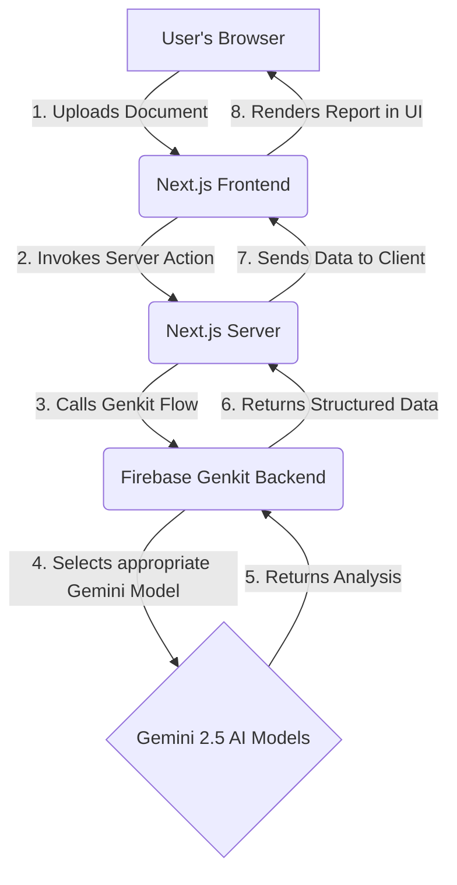

# Vidhik AI: Demystifying Legal Documents for Everyone

## 1. Vision, Social Impact & Feasibility

### The Problem Your Solution Addresses

In India, millions of people—from students renting their first apartment to small business owners signing service agreements—enter into legally binding contracts without fully understanding the terms. This lack of comprehension stems from two significant barriers:

1.  **Complex Legal Jargon:** Legal documents are filled with technical language that is impenetrable to the average person.
2.  **The Language Divide:** A vast number of contracts are written exclusively in English, a language not accessible to a large portion of the Indian population, which is multilingual and diverse.

This information gap puts individuals at a severe disadvantage, exposing them to financial risks, unfair obligations, and potential exploitation. The cost of hiring a lawyer to review routine documents is prohibitive for the vast majority, creating a critical need for accessible, first-line legal support.

### Your Compelling Vision & Positive Impact

**Vidhik AI** is an intelligent legal assistant designed to empower the common person by making legal documents simple, accessible, and understandable.

Our vision is to **create a future where no one is disadvantaged by a contract they couldn't comprehend.** By leveraging the power of Generative AI, Vidhik AI acts as a private, secure, and insightful legal companion. It translates dense legal text into plain, simple English, proactively flags potential risks, and answers specific questions in a conversational manner.

This vision directly aligns with the focus area of **empowering people with access to information and opportunity**. Vidhik AI achieves this by:

*   **Promoting Financial & Legal Literacy:** By demystifying contracts, we help people understand their financial commitments (like rent, loans, and service fees) and legal rights, preventing debt traps and unfair contractual obligations.
*   **Bridging the Language Divide:** Our AI is designed to understand documents in major Indian regional languages. A user can upload a document in their native tongue and receive a clear, structured analysis in simple English, breaking down a significant barrier to comprehension.
*   **Democratizing Legal Understanding:** We provide a free, accessible tool that offers the kind of initial document analysis typically reserved for those who can afford legal counsel. This empowers students, gig-economy workers, renters, and small business owners to make informed decisions with confidence.

### Feasibility and Scalability

The project is highly feasible and built for scale:

*   **Feasibility:** The technical foundation is solid and uses modern, production-ready technologies. By using **Firebase Genkit** to orchestrate calls to Google's powerful **Gemini 2.5 series models**, we can achieve a high degree of accuracy in contextual understanding and analysis right from the start. The strategic use of different models (`2.5-flash` for speed and `2.5-pro` for complexity) makes the application both powerful and cost-effective.
*   **Scalability:** The entire stack is serverless. **Next.js** provides a performant frontend, and **Firebase Genkit** runs in a serverless environment that can automatically scale to handle a massive number of users without manual intervention. This architecture ensures that as the user base grows, the application remains fast and responsive.

## 2. Opportunity and Unique Value Proposition

### How is Vidhik AI different from existing solutions?

While other document analysis tools exist, Vidhik AI is uniquely positioned for the Indian context:

*   **Hyper-Localized:** Our primary differentiator is the deep integration of multilingual capabilities, specifically supporting major Indian regional languages. Users can upload a document in their native language and receive analysis and answers, breaking down barriers that generic, English-first tools cannot.
*   **Action-Oriented Output:** We go beyond simple summarization. Features like the "Jargon Buster," categorized "Risk Analysis," and the ability to export deadlines to a calendar provide actionable insights that empower users to act on the information.
*   **Conversational Interface:** The ability to ask follow-up questions in natural language (including Hinglish) transforms a static analysis into an interactive, personalized legal consultation.

### How will it solve the problem?

Vidhik AI directly tackles the core problems of legal complexity and language barriers by acting as a "first line of defense" for the common person.

1.  **It translates complexity into clarity:** By converting dense legalese into simple English summaries, risk warnings, and glossaries, it bridges the knowledge gap.
2.  **It makes information accessible:** By accepting documents in regional languages, it ensures that language is no longer a barrier to understanding one's rights and obligations.
3.  **It reduces financial risk:** By flagging potentially harmful clauses and unclear deadlines, it helps users avoid costly mistakes and unfair agreements before they are signed.

### USP (Unique Selling Proposition)

**Vidhik AI is the first AI-powered legal assistant designed for India's linguistic diversity, transforming complex legal documents in any major regional language into simple, actionable insights that anyone can understand.**

## 3. Project Functionalities & Features

### List of Features Offered

1.  **AI Document Helper:**
    *   **File/Text Upload:** Supports various document formats and direct text pasting.
    *   **Multilingual Support:** Accepts documents in English and major Indian languages.
    *   **Feature Summary:** Generates a high-level overview in markdown.
    *   **Risk Analysis:** Identifies and categorizes risks (High, Medium, Low).
    *   **Jargon Buster:** Creates a glossary of complex legal terms.
    *   **Obligations & Deadlines Tracker:** Extracts key dates and allows calendar export.
    *   **Conversational Q&A:** Interactive chat to ask follow-up questions about the document.

2.  **Compare Documents:**
    *   **Side-by-Side Upload:** Interface to upload two document versions.
    *   **Difference Report:** Generates a detailed report of new, changed, and deleted clauses.

3.  **Document & Session Management:**
    *   **Session History:** Saves and allows revisiting of past analysis/comparison sessions.
    *   **My Documents:** A gallery of all unique documents for quick access.

## 4. Technical Implementation & Architecture

### Technologies Used

*   **Frontend:** Next.js (App Router), React, TypeScript
*   **UI:** Tailwind CSS, ShadCN UI
*   **AI Backend:** Firebase Genkit
*   **AI Models:** Google's Gemini 2.5 Flash & Gemini 2.5 Pro
*   **Server Logic:** Next.js Server Actions

### Architecture Diagram (High-Level)



### Process Flow Diagram (AI Document Helper Use Case)

```mermaid
graph TD
    subgraph User Interaction
        A(Start) --> B{Upload or Paste Document};
        B --> C[Click "Demystify"];
    end

    subgraph Backend Process
        C --> D{Server Action Triggered};
        D --> E[Call `demystifyDocument` Genkit Flow];
        E --> F(Gemini API Call);
        F --> G[Receive Structured JSON];
    end

    subgraph UI Rendering
        G --> H{Update UI State};
        H --> I[Display Summary, Risks, etc.];
        I --> J(Chat Interface Enabled);
        J --> K{User Asks Question};
        K --> D;
        I --> L(End);
    end
```

### Mock Diagram / UI Layout

The application is designed as a professional, three-panel dashboard layout:

1.  **Main Sidebar (Left):** A permanent navigation bar providing access to core features: "AI Document Helper," "Compare Documents," "My Documents," and "Info & FAQ." It also contains a search bar for filtering history and documents.
2.  **Main Content Area (Center):** This is the primary workspace. It dynamically changes based on the selected feature.
    *   For the **AI Helper**, it initially shows the file upload/paste interface. After analysis, it transforms into a multi-tab view displaying the Summary, Risk Analysis, Jargon Buster, and Original Document.
    *   For **Document Comparison**, it shows two upload slots and, after processing, the detailed comparison report.
3.  **History Panel (Right, Collapsible):** This panel shows a chronological list of all past sessions (both analysis and comparisons). Users can click on a session to load its results back into the main content area.

### Brief About the Prototype

The current prototype is a fully functional implementation of the vision. It successfully integrates the Next.js frontend with the Firebase Genkit backend to perform all the core functionalities described. Users can upload documents, receive a comprehensive multi-tab analysis, ask follow-up questions, and compare document versions. The session history and document management features are also operational, providing a complete and cohesive user experience that is ready for testing and evaluation.

## 5. Detailed Instructions for Judges to Access and Test

### Accessing the Solution

1.  **Open the Application:** Please navigate to the provided application URL in your web browser.
2.  **API Key Configuration:** The application requires a Google Gemini API key to function. Please enter your key into the `.env` file in the root directory:
    ```
    GEMINI_API_KEY="YOUR_API_KEY_HERE"
    ```
    After saving the `.env` file, the application will be ready for testing.

### Testing Scenarios

#### Scenario 1: Demystify a Rental Agreement (AI Document Helper)

1.  **Navigate:** From the sidebar, ensure you are on the **"AI Document Helper"** screen.
2.  **Upload:** Use the "Upload File" or "Paste Text" tab to input a sample rental agreement. (Many standard templates are available online).
3.  **Analyze:** Click the **"Demystify Document"** button.
4.  **Review the Report:**
    *   Check the **"Feature Summary"** tab for a clear, high-level overview.
    *   Go to the **"Risk Analysis"** tab to see if any clauses were flagged.
    *   Explore the **"Jargon Buster"** to understand complex terms.
    *   Visit the **"Obligations & Deadlines"** tab. Click the **"Export to Calendar"** button to download an `.ics` file containing key dates.
5.  **Ask Questions:**
    *   The chat interface will now be active. Ask a specific question about the document, for example:
        *   "What is the notice period for terminating the lease?"
        *   (In Hinglish) "Security deposit kab wapas milega?"
    *   Verify that the AI provides a relevant and accurate answer based on the document's content.

#### Scenario 2: Compare Two Versions of a Contract (Compare Documents)

1.  **Navigate:** Click **"Compare Documents"** in the sidebar.
2.  **Upload Documents:**
    *   In the "Document A" slot, upload an original contract.
    *   In the "Document B" slot, upload a modified version of the same contract (e.g., change the rent amount, add a new clause, or remove one).
3.  **Compare:** Click the **"Compare Documents"** button.
4.  **Review the Comparison Report:**
    *   Examine the generated report which should clearly list any **New Clauses**, **Changed Terms**, and **Deleted Clauses** you introduced.

#### Scenario 3: Check History and My Documents

1.  **View History:** After performing the tests above, click the **History icon** in the top-right corner of either the "Helper" or "Compare" view. The side panel should show a list of your recent sessions.
2.  **Switch Sessions:** Click on a previous session in the history panel. The application state should update to show the documents and results from that session.
3.  **Navigate:** Click **"My Documents"** in the main sidebar.
4.  **Verify:** You should see cards representing each unique document you uploaded during your testing. Clicking on one of these cards will start a new "AI Document Helper" session with that document.
